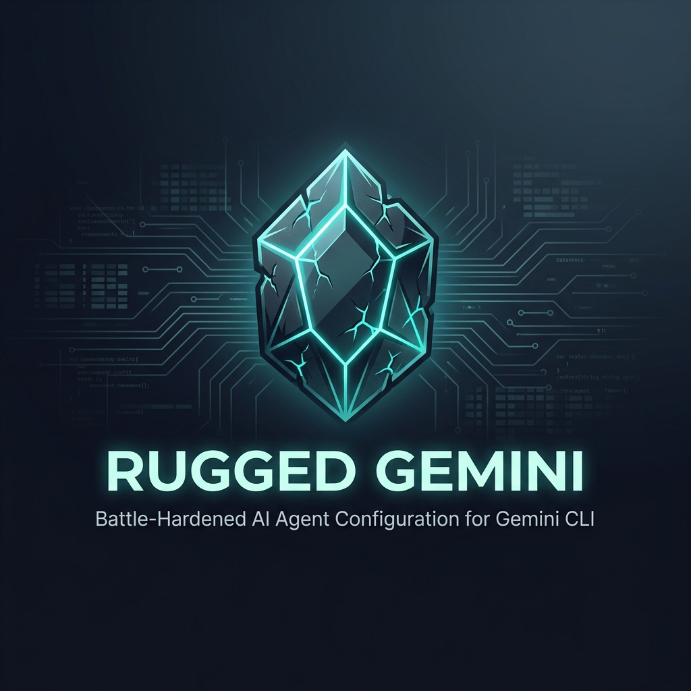

<div align="center">
  
  <h3 align="center">Rugged Gemini</h3>

  <p align="center">
    A rugged, high-quality configuration suite for AI Agents on Gemini CLI.
    <br />
    <a href="#getting-started">Getting Started</a>
    ·
    <a href="#usage">View Rules & Skills</a>
    ·
    <a href="https://github.com/irahardianto/rugged-gemini/issues">Request Feature</a>
    ·
    <br />
    <br />
  </p>
</div>

<!-- ABOUT THE PROJECT -->
## About Rugged Gemini

**Rugged Gemini** provides a comprehensive sets of standards and practices designed to elevate the capabilities of AI coding agents, specifically for **Gemini CLI**. It provides a suite of strict rules distilled from software engineering best practices that ensure generated code is secure, defensible, and maintainable. It also provides specialized skills that will help throughout software development.

Instead of just generating code that works, the rules and skills ensures agents generate code that **survives**.

> **⚠️ Opinionated by design.** Rugged Gemini ships with opinionated defaults for specific technology stacks. See [Opinionated Technology Choices](#opinionated-technology-choices) for details and how to customize.

While this configuration is originally adapted from [Awesome AGV](https://github.com/irahardianto/awesome-agv), it is purpose-built for the [Gemini CLI](https://github.com/google-gemini/gemini-cli) ecosystem. All rules have been consolidated into a single `GEMINI.md` file that is auto-loaded in every session, providing a seamless and powerful development experience.

You can drop this configuration into the root of your project to transform how your Gemini CLI behaves.

### Key Features

*   📏 **Consolidated Rules** — covering security, reliability, architecture, maintainability, language idioms, and DevOps, all inside a single auto-loaded `GEMINI.md`.
*   🤖 **15 Specialized Agents** — organized into Research, Builder, and Reviewer layers with strict MECE domain boundaries.
*   🛠️ **66 Specialized Skills** — on-demand capabilities spanning 16 languages/frameworks, debugging, design, performance, security, and more.
*   🔄 **Orchestrated Commands** — end-to-end development processes via `/orchestrate` and `/refactor` native Gemini CLI commands with 11 workflow templates.

> **💡 Everything is modular.** Agents, rules, and skills work independently — you don't need workflows to benefit from them. Use only what you need, modify anything, or build your own commands. It's a toolkit, not a framework.

<!-- GETTING STARTED -->
## Getting Started

To equip your AI agent with these superpowers, follow these steps.

### Prerequisites

*   An AI Coding Assistant ([Gemini CLI](https://github.com/google-gemini/gemini-cli))
*   A project where you want to enforce high standards.

### Installation

**Quick Install (recommended):**
1.  Clone this repository or copy the `.gemini/` folder into the root of your project.
    ```sh
    cp -r /path/to/rugged-gemini/.gemini ./your-project-root/
    ```
2.  Copy `GEMINI.md` to your project root (Gemini CLI auto-loads this file).
    ```sh
    cp ./your-project-root/.gemini/GEMINI.md ./your-project-root/GEMINI.md
    ```
3.  Update `settings.json` to match your MCP server installations (if applicable).

### Examples

```bash
# Clone the repository
git clone https://github.com/irahardianto/rugged-gemini.git

# Copy into a specific project
cp -r rugged-gemini/.gemini ./my-project/

# Copy the GEMINI.md to the project root
cp ./my-project/.gemini/GEMINI.md ./my-project/GEMINI.md
```

<!-- USAGE -->
## Usage

Once installed, the rules and skills in this repository become active for your agent. Gemini CLI automatically picks up the configuration.

### Rule Architecture

The setup uses a centralized rule system to minimize noise while maximizing coverage:

| Type                      | Mechanism          | Purpose                                                                                                                      |
| ------------------------- | ------------------ | ---------------------------------------------------------------------------------------------------------------------------- |
| **Mandates & Principles** | `GEMINI.md`        | Non-negotiable constraints and core principles loaded in *every* session (security, architecture, logging).                  |
| **Specialized Skills**    | On-Demand Loading  | Contextual guidance and language idioms activated dynamically by agents only when working on relevant tasks.                 |

Conflicts between rules are resolved by the Rule Priority defined in `GEMINI.md` — security always wins.

### Comprehensive Rule Suite

The power of the setup comes from its extensive collection of rules covering every aspect of software engineering. Most core rules are baked right into `GEMINI.md`.

#### 🛡️ Security & Integrity
*   **Rugged Software Constitution**: The core philosophy of defensible coding.
*   **Security Mandate**: Non-negotiable security requirements.
*   **Security Principles**: Best practices for secure design.

#### ⚡ Reliability & Performance
*   **Error Handling Principles**: Techniques for robust error management.
*   **Concurrency & Threading**: Safe parallel execution and deadlock prevention.
*   **Concurrency & Threading Mandate**: When to use (and not use) concurrency.
*   **Performance Optimization**: Writing efficient and scalable code.
*   **Resource Management**: Handling memory and system resources responsibly.
*   **Monitoring & Alerting**: Health checks, metrics, and graceful degradation.
*   **Configuration Management**: Environment variables, secrets, and config hierarchy.

#### 🏗️ Architecture & Design
*   **Core Design Principles**: Fundamental software design rules (SOLID, DRY, etc.).
*   **API Design Principles**: Creating clean, intuitive, and versionable APIs.
*   **Architectural Pattern**: Testability-first design with I/O isolation.
*   **Project Structure**: Feature-based organization (the single source of truth for layout).
*   **Database Design**: Schema design, migrations, and query safety.
*   **Data Serialization**: Safe data handling and formats.
*   **Command Execution**: Principles for running system commands securely.

#### 🧩 Maintainability & Quality
*   **Code Organization**: Structuring projects for readability.
*   **Code Idioms**: Following language-specific best practices.
*   **Testing Strategy**: Ensuring code is verifiable and tested.
*   **Dependency Management**: Managing external libraries safely.
*   **Documentation Principles**: Writing clear and helpful documentation.
*   **Logging & Observability**: Ensuring system visibility.
*   **Logging & Observability Mandate**: All operations must be logged — no exceptions.
*   **Accessibility Principles**: WCAG 2.1 AA compliance for UIs.
*   **Git Workflow**: Conventional commits, branch naming, and PR hygiene.

#### 🔄 DevOps & Operations
*   **CI/CD Principles**: Pipeline design, Docker, and GitHub Actions.
*   **CI/CD GitOps Kubernetes**: ArgoCD, Kubernetes deployment patterns (PRD-gated).
*   **Feature Flags Principles**: Flag types, lifecycle, and rollout strategies (PRD-gated).
*   **Code Completion Mandate**: Automated quality checks before every delivery.
*   **Rule Priority**: Conflict resolution when rules contradict each other.

### Specialized Skills

Loadable on demand via the `.gemini/skills/` directory:

#### 🔤 Language & Framework Idioms (24 skills)
*   **10 Language Idioms**: Go, TypeScript, Rust, Python, Java, C#, C++, Swift, Kotlin, Elixir, JavaScript, PHP, Ruby, SQL
*   **8 Framework Idioms**: Vue 3, Flutter, React, Angular, Next.js, Django, Laravel, Rails, Spring Boot, .NET

#### 🔧 Process & Domain Skills
*   **Debugging Protocol**: Systematic hypothesis-driven approach to solving errors.
*   **Code Review**: Structured code review protocol against the full rule set.
*   **Guardrails**: Pre-flight checklist and post-implementation self-review.
*   **Sequential Thinking**: A tool for breaking down complex problems.
*   **ADR (Architecture Decision Records)**: Document significant architectural decisions with context and trade-offs.
*   **Research Methodology**: Structured research workflows and source verification.

#### 🎨 Design & Architecture Skills
*   **Frontend Design**: Guidelines for creating visually appealing UIs (includes Vue framework guide).
*   **Mobile Design**: Production-grade mobile interfaces for Flutter and React Native.
*   **Project Structure**: Feature-based layouts for Go, Vue, Python, Rust, and Flutter.
*   **API Design Principles**: RESTful API design, versioning, and contract-first development.

#### ⚡ Performance & Operations Skills
*   **Performance Optimization**: Profile-driven performance optimization tooling.
*   **Incident Response**: Structured triage, root-cause analysis, and postmortem workflows.
*   **Chaos Testing**: Failure injection strategies and resilience validation.
*   **Supply Chain Security**: Dependency auditing, SBOM generation, and vulnerability management.

#### 🏗️ Specialized Domain Skills
*   **Data Engineering**: ETL pipelines, data validation, and warehouse patterns.
*   **ML Engineering**: Model training, serving, and experiment tracking.
*   **CLI Development**: Command-line tool design, argument parsing, and UX.
*   **Payment Integration**: PCI compliance, idempotency, and payment gateway patterns.
*   **Embedded Systems**: Resource-constrained development and hardware interaction.
*   **API Documentation**: OpenAPI specs, SDK generation, and developer portal guides.
*   **Refactoring Patterns**: Code smell detection and safe transformation techniques.

### Development Workflows

The setup includes native Gemini CLI commands for orchestration and safe refactoring.

#### 🏭 Feature Workflow (`/orchestrate`)

Decomposes user requirements into sub-agent dispatches.

```
SCOUT → DESIGN → BUILD → TEST → REVIEW → REMEDIATE → VERIFY → DOCUMENT
```

Additional specialized primitives: `OPTIMIZE` (performance), `INCIDENT` (triage & postmortem), `REFACTOR` (safe code transformation).

#### 🔧 Specialized Workflows

| Command | When to Use |
| --- | --- |
| `/orchestrate` | Full multi-agent pipelines for features, bugs, security hardening, or doc sprints. |
| `/refactor` | Safely restructure code while preserving behavior through incremental changes. |

<!-- DIRECTORY STRUCTURE -->
## Directory Structure

```
.gemini/
├── GEMINI.md              # Consolidated engineering rules (auto-loaded)
├── settings.json          # MCP server configurations (Pathfinder, Playwright)
├── agents/                # 15 specialized agent personas
│   ├── architect.md
│   ├── backend-engineer.md
│   ├── frontend-engineer.md
│   ├── mobile-engineer.md
│   ├── database-expert.md
│   ├── devops-engineer.md
│   ├── test-automation-engineer.md
│   ├── technical-writer.md
│   ├── qa-analyst.md
│   ├── security-engineer.md
│   ├── ux-reviewer.md
│   ├── scout.md              # NEW — research & exploration
│   ├── performance-engineer.md  # NEW — profiling & optimization
│   ├── incident-responder.md    # NEW — triage & postmortems
│   └── refactoring-specialist.md  # NEW — safe code transformation
├── commands/              # 2 orchestrated commands
│   ├── orchestrate.toml   # Multi-agent pipeline manager (11 templates)
│   └── refactor.toml      # Safe incremental restructuring (3-path elicitation)
└── skills/                # 66 on-demand skills
    ├── go-idioms/         # Language idioms (10 languages)
    ├── typescript-idioms/
    ├── rust-idioms/
    ├── python-idioms/
    ├── java-idioms/       # NEW
    ├── csharp-idioms/     # NEW
    ├── cpp-idioms/        # NEW
    ├── swift-idioms/      # NEW
    ├── kotlin-idioms/     # NEW
    ├── elixir-idioms/     # NEW
    ├── javascript-idioms/ # NEW
    ├── sql-idioms/        # NEW
    ├── php-idioms/        # NEW
    ├── ruby-idioms/       # NEW
    ├── vue-idioms/        # Framework idioms (8 frameworks)
    ├── flutter-idioms/
    ├── react-idioms/      # NEW
    ├── angular-idioms/    # NEW
    ├── nextjs-idioms/     # NEW
    ├── django-idioms/     # NEW
    ├── laravel-idioms/    # NEW
    ├── rails-idioms/      # NEW
    ├── spring-boot-idioms/ # NEW
    ├── dotnet-idioms/     # NEW
    ├── debugging-protocol/ # Process & domain skills
    ├── code-review/
    ├── guardrails/
    ├── incident-response/ # NEW
    ├── chaos-testing/     # NEW
    ├── refactoring-patterns/ # NEW
    ├── supply-chain-security/ # NEW
    ├── data-engineering/  # NEW
    ├── ml-engineering/    # NEW
    ├── cli-development/   # NEW
    ├── payment-integration/ # NEW
    ├── embedded-systems/  # NEW
    ├── api-documentation/ # NEW
    └── ...                # + 22 more (perf, adr, design, etc.)
```

<!-- ROADMAP -->
## Roadmap

- [x] Adapt Awesome AGV rules for the Gemini CLI ecosystem.
- [x] Consolidate mandates and principles into `GEMINI.md`.
- [x] Create native `.toml` commands for orchestration.
- [x] Define specialized agent personas tailored for Gemini CLI.
- [ ] Add automated validation scripts to check if an agent is following the constitution.
- [ ] Publish comprehensive documentation site.

## Opinionated Technology Choices

Rugged Gemini ships with **opinionated defaults** for specific technology stacks. Each stack has dedicated idiom skills with patterns, tooling, and verification commands.

| Stack            | Default Choice                                      | Skill File(s)                                       |
| ---------------- | --------------------------------------------------- | --------------------------------------------------- |
| **Backend**      | Go — vanilla stdlib, minimal deps                   | `go-idioms/SKILL.md`                                |
| **Frontend**     | TypeScript + Vue 3 — Composition API, Pinia, Vitest | `typescript-idioms/SKILL.md`, `vue-idioms/SKILL.md` |
| **Mobile**       | Flutter + Riverpod — freezed models, go_router      | `flutter-idioms/SKILL.md`                           |
| **Systems**      | Rust — tokio, thiserror/anyhow, clippy pedantic     | `rust-idioms/SKILL.md`                              |
| **Scripting/AI** | Python — ruff, mypy strict, pytest, Pydantic        | `python-idioms/SKILL.md`                            |

**Community Language Support** — additional idiom skills available (no opinionated defaults):

| Language/Framework | Skill File |
| --- | --- |
| Java / Spring Boot | `java-idioms/SKILL.md`, `spring-boot-idioms/SKILL.md` |
| C# / .NET | `csharp-idioms/SKILL.md`, `dotnet-idioms/SKILL.md` |
| PHP / Laravel | `php-idioms/SKILL.md`, `laravel-idioms/SKILL.md` |
| Ruby / Rails | `ruby-idioms/SKILL.md`, `rails-idioms/SKILL.md` |
| C++ | `cpp-idioms/SKILL.md` |
| Swift | `swift-idioms/SKILL.md` |
| Kotlin | `kotlin-idioms/SKILL.md` |
| Elixir | `elixir-idioms/SKILL.md` |
| JavaScript | `javascript-idioms/SKILL.md` |
| SQL | `sql-idioms/SKILL.md` |
| React | `react-idioms/SKILL.md` |
| Angular | `angular-idioms/SKILL.md` |
| Next.js | `nextjs-idioms/SKILL.md` |
| Django | `django-idioms/SKILL.md` |

**Using a different framework?** The idiom skills are modular — swap or edit them to match your stack.

## Project Adaptation Guide

This setup supports different project structures:

| Project Type            | Adaptation                                                       |
| ----------------------- | ---------------------------------------------------------------- |
| **Monorepo** (default)  | Use as-is                                                        |
| **Single backend**      | Remove frontend skills, keep backend agents                      |
| **Single frontend**     | Remove backend skills, keep frontend agents                      |
| **Microservices**       | Adapt `project-structure` skills per service                     |
| **Mobile (Flutter/RN)** | Adapt frontend agents, focus on mobile skills                    |

**To adapt:** Edit `GEMINI.md` project structure section, the relevant idiom skills, and the test commands to match your project layout.

<!-- CONTRIBUTING -->
## Contributing

Contributions are what make the open source community such an amazing place to learn, inspire, and create. Any contributions you make are **greatly appreciated**.

1.  Fork the Project
2.  Create your Feature Branch (`git checkout -b feature/AmazingFeature`)
3.  Commit your Changes (`git commit -m 'Add some AmazingFeature'`)
4.  Push to the Branch (`git push origin feature/AmazingFeature`)
5.  Open a Pull Request

<!-- LICENSE -->
## License

Distributed under the MIT License. See the [LICENSE](LICENSE) file for details.

---

<p align="center">
  Built with ❤️ for the Developer Community
</p>
